# DhakaRoadNet: Edge AI Road Object Detection for Dhaka Urban Traffic

DhakaRoadNet is an end-to-end Edge AI project for road-object detection in Bangladeshi urban traffic. The project starts from real Dhaka road data, builds a custom YOLOv8 dataset, trains and evaluates a YOLOv8n detector, tests the model in Gradio, exports TensorFlow Lite models, and deploys the final FP16 model in a native Android app with image upload, camera capture, and live video detection.


## Quick Access

| Item | Link |
|---|---|
| Android APK | [Download APK](https://drive.google.com/file/d/1wwRxs1KPAC0pcS_NYQPe6BHcIzG3bBTd/view?usp=drive_link) |
| YouTube playlist | [DhakaRoadNet demo playlist](https://youtube.com/playlist?list=PLGDauvi1YQZpz6C1_MwhnCCV78hUAxQ8P&si=XkssZIbhC0CD2wXL) |
| Demo video | [YouTube demo](https://youtu.be/Eo7YuJk4OxI) |
| Demo short | [YouTube short](https://youtube.com/shorts/abO-KK6qff0?feature=share) |
| Dataset notebook | [01_dataset_download_and_verification.ipynb](notebooks/01_dataset_download_and_verification.ipynb) |
| Training notebook | [02_training.ipynb](notebooks/02_training.ipynb) |
| Evaluation notebook | [03_evaluation_and_analysis.ipynb](notebooks/03_evaluation_and_analysis.ipynb) |
| Gradio notebook | [04_model_deployment_using_Gradio.ipynb](notebooks/04_model_deployment_using_Gradio.ipynb) |
| TFLite export notebook | [05_export_tflite.ipynb](notebooks/05_export_tflite.ipynb) |
| Final PyTorch model | [best.pt](model/checkpoints/yolov8n_dhakaroadnet_baseline/best.pt) |
| Android TFLite model | [dhakaroadnet_yolov8n_fp16.tflite](model/exported/tflite/dhakaroadnet_yolov8n_fp16.tflite) |
| Android app source | [android_app](android_app) |

## Project Overview

DhakaRoadNet is not only a model-training notebook. It is a complete applied AI pipeline:

- Raw Dhaka road scenes were collected and prepared for object detection.
- Images were annotated and exported in YOLOv8 format.
- The dataset was verified with split checks, class distribution, annotation counts, and sample visualizations.
- A YOLOv8n model was trained on a personal NVIDIA RTX 3050 GPU.
- The trained `best.pt` model was evaluated on validation and test splits.
- The model was tested in a Gradio app using real unseen road images.
- TensorFlow Lite models were exported for Android deployment.
- A native Android app was built with still-image detection and live video detection.

## Why This Project Is Unique

- **Local dataset focus:** The project targets Dhaka/Bangladeshi road objects, not only public benchmark classes.
- **Full research workflow:** Data collection, annotation, verification, training, evaluation, deployment, and Android app testing are all included.
- **Edge AI deployment:** The Android app runs inference locally with the packaged TFLite FP16 model. No server API is required.
- **Practical app proof:** The app supports gallery image detection, camera capture detection, live video detection, save/share result, and annotation details.
- **Honest evaluation:** The project includes metrics, weak-class analysis, TFLite export comparison, and future improvement notes.

## Headline Results

| Area | Result |
|---|---:|
| Dataset images | 2,145 |
| Annotation boxes | 23,448 |
| Classes | 24 |
| Model | YOLOv8n |
| Parameters | 3,015,528 |
| Validation mAP50 | 0.7980 |
| Validation mAP50-95 | 0.5390 |
| Test mAP50 | 0.7429 |
| Test mAP50-95 | 0.4783 |
| Android model | TFLite FP16 |
| App mode | Offline on-device inference |
| Android TFLite speed | Around 500 ms per inference on tested devices |

## App UI Preview

The Android app presents the project overview, image/camera detection flow, and on-device model output in a simple native interface.

<p align="center">
  <a href="reports/app_ui/app_ui.jpeg">
    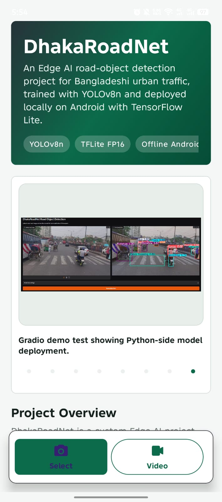
  </a>
  <a href="reports/app_ui/app_ui2.jpeg">
    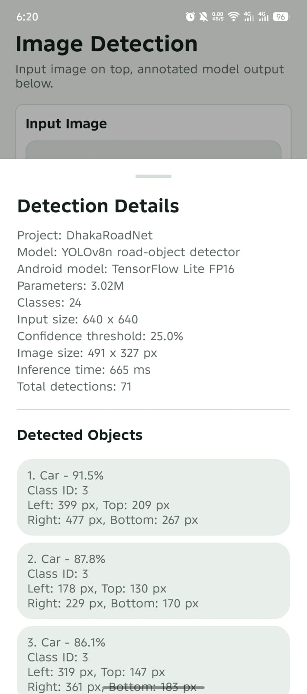
  </a>
  <a href="reports/app_ui/app_ui3.jpeg">
    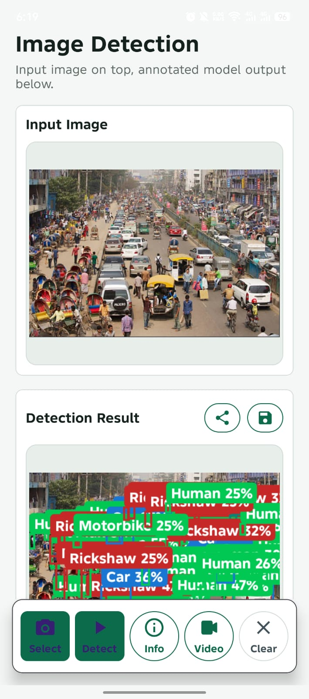
  </a>
</p>

## Android App Features

- Upload image from gallery.
- Capture image using camera.
- Run offline road-object detection.
- See input image and annotated output.
- Open annotation details in a scrollable bottom sheet.
- Save and share annotated detection results.
- Run live video detection with CameraX.
- Adjust live confidence threshold.
- View project research details inside the app.
- In real-device testing, the FP16 TFLite model usually runs around 500 ms per inference. This can vary by phone hardware, CPU load, image complexity, and live camera mode.

## Full Project Workflow

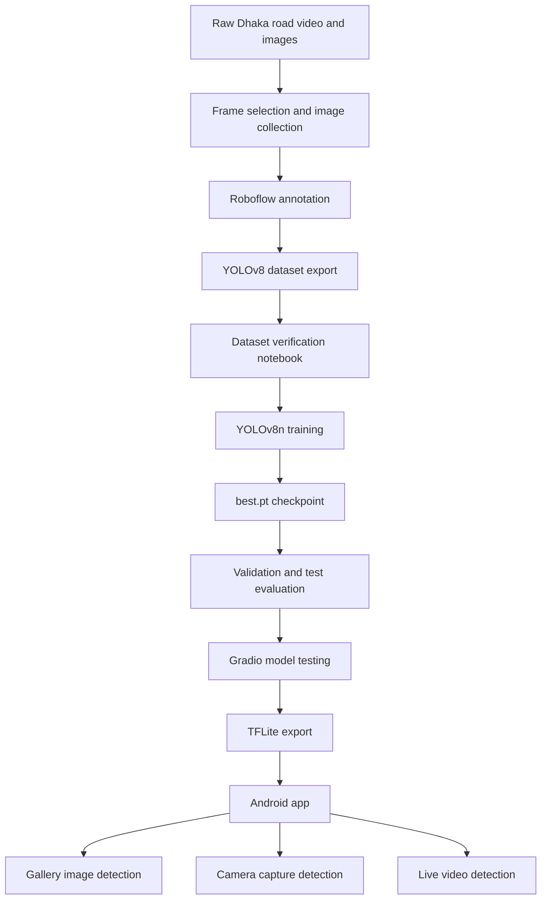
```mermaid
flowchart TD
    A[Raw Dhaka road video and images] --> B[Frame selection and image collection]
    B --> C[Roboflow annotation]
    C --> D[YOLOv8 dataset export]
    D --> E[Dataset verification notebook]
    E --> F[YOLOv8n training]
    F --> G[best.pt checkpoint]
    G --> H[Validation and test evaluation]
    H --> I[Gradio model testing]
    I --> J[TFLite export]
    J --> K[Android app]
    K --> L[Gallery image detection]
    K --> M[Camera capture detection]
    K --> N[Live video detection]
```

## Quick App Install Guide

1. Download the APK from the [APK link](https://drive.google.com/file/d/1wwRxs1KPAC0pcS_NYQPe6BHcIzG3bBTd/view?usp=drive_link).
2. Open the APK on an Android phone.
3. If Android asks for permission to install unknown apps, allow it for the browser/file manager you are using.
4. Install and open **DhakaRoadNet**.
5. Use **Select** to upload an image, capture a photo, or load a built-in sample.
6. Tap **Detect** for still-image detection.
7. Tap **Video** for live camera detection.
8. Use **Info** to inspect model output details.
9. Use save/share buttons to export annotated results.

<details>
<summary><strong>📦 Dataset Creation</strong></summary>

## Dataset Story

The dataset was built from real Dhaka road scenes. The goal was to create a local road-object detector that understands objects commonly seen in Bangladeshi urban traffic.

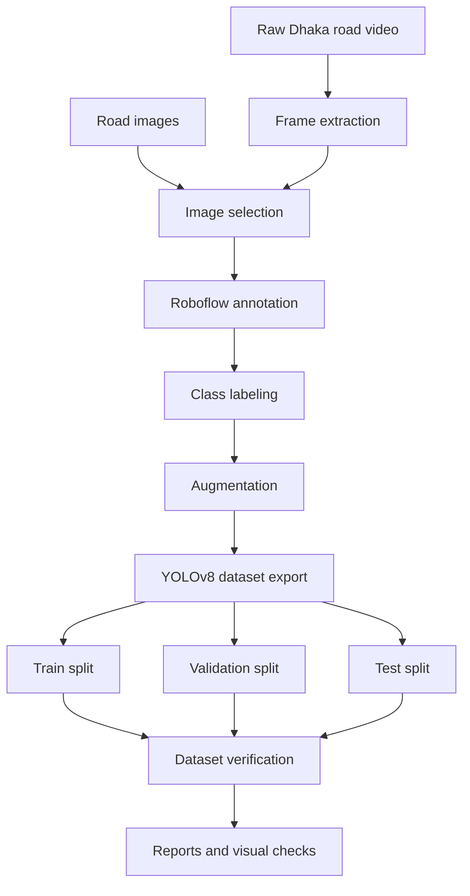
```mermaid
flowchart TD
    A[Raw Dhaka road video] --> B[Frame extraction]
    A2[Road images] --> C[Image selection]
    B --> C
    C --> D[Roboflow annotation]
    D --> E[Class labeling]
    E --> F[Augmentation]
    F --> G[YOLOv8 dataset export]
    G --> H[Train split]
    G --> I[Validation split]
    G --> J[Test split]
    H --> K[Dataset verification]
    I --> K
    J --> K
    K --> L[Reports and visual checks]
```

## Dataset Summary

| Split | Images | Label files | Annotation boxes | Boxes per image |
|---|---:|---:|---:|---:|
| Train | 1,754 | 1,754 | 19,164 | 10.926 |
| Validation | 195 | 195 | 2,013 | 10.323 |
| Test | 196 | 196 | 2,271 | 11.587 |
| Total | 2,145 | 2,145 | 23,448 | - |

Health checks found no missing image-label pairs in the verified dataset.

## Classes

```text
Auto rickshaw, Bicycle, Bus, Car, Dog, Garbage van, Human, Leguna,
Manhole, Micro Bus, Mini truck, Minivan, Motorbike, Pickup truck,
Police car, Pothole, Rickshaw, Road barrier, SUV, Speed Breaker,
Three wheelers -CNG-, Truck, Van, Zebra Crossing
```

## Main Dataset Notebook

- [01_dataset_download_and_verification.ipynb](notebooks/01_dataset_download_and_verification.ipynb)
- [dataset_summary.csv](reports/dataset_summary.csv)
- [class_distribution.csv](reports/class_distribution.csv)
- [dataset_issues.csv](reports/dataset_issues.csv)

</details>

<details>
<summary><strong>🧠 Model Training</strong></summary>

## Training Architecture

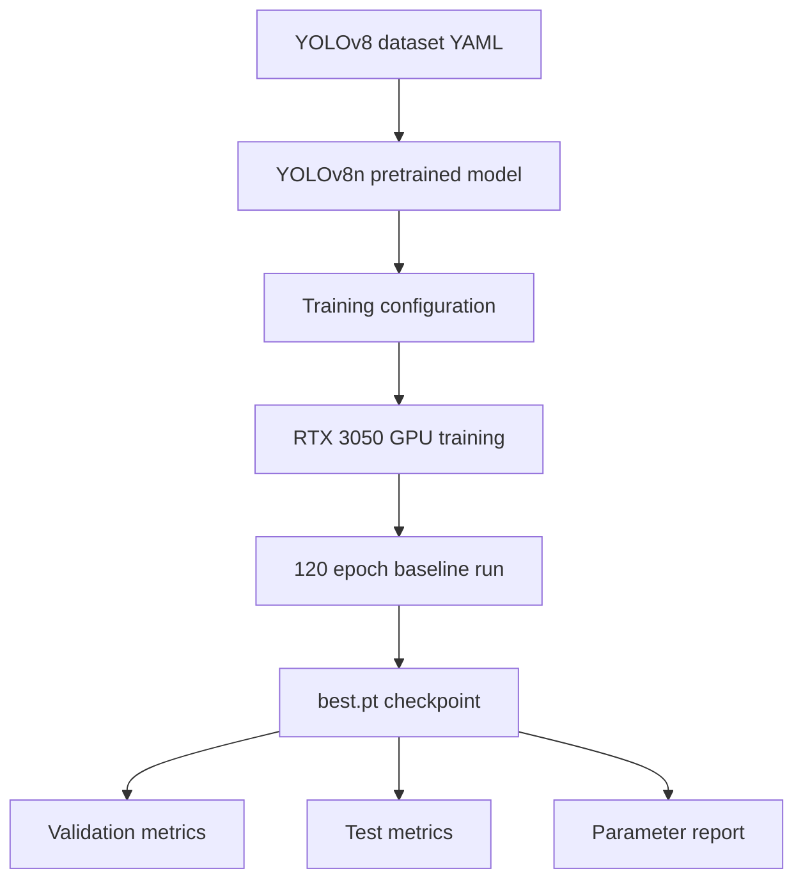
```mermaid
flowchart TD
    A[YOLOv8 dataset YAML] --> B[YOLOv8n pretrained model]
    B --> C[Training configuration]
    C --> D[RTX 3050 GPU training]
    D --> E[120 epoch baseline run]
    E --> F[best.pt checkpoint]
    F --> G[Validation metrics]
    F --> H[Test metrics]
    F --> I[Parameter report]
```

## Training Setup

| Item | Value |
|---|---|
| Base model | YOLOv8n |
| Image size | 640 x 640 |
| Epochs | 120 |
| Patience | 25 |
| Batch size | 16 |
| Optimizer | AdamW |
| Learning rate | 0.001 |
| Weight decay | 0.0005 |
| Seed | 42 |
| Device | NVIDIA RTX 3050 GPU |
| AMP | Enabled |

## Augmentation Setup

| Augmentation | Value |
|---|---:|
| Horizontal flip | 0.5 |
| Vertical flip | 0.0 |
| Degrees | 5.0 |
| Translate | 0.1 |
| Scale | 0.4 |
| Shear | 2.0 |
| Mosaic | 0.8 |
| MixUp | 0.05 |
| Close mosaic | Last 15 epochs |

## Parameter Count

The final `best.pt` checkpoint has **3,015,528 parameters**, about **3.02 million parameters**.

See the full parameter report: [best_pt_parameter_report.md](reports/best_pt_parameter_report.md)

## Main Training Files

- [02_training.ipynb](notebooks/02_training.ipynb)
- [training_report.md](reports/training_report.md)
- [training_config.yaml](reports/training/yolov8n_dhakaroadnet_baseline/training_config.yaml)
- [best.pt](model/checkpoints/yolov8n_dhakaroadnet_baseline/best.pt)

</details>

<details>
<summary><strong>📊 Evaluation and Analysis</strong></summary>

## Evaluation Results

| Split | Precision | Recall | F1 | mAP50 | mAP50-95 |
|---|---:|---:|---:|---:|---:|
| Validation | 0.8362 | 0.7468 | 0.7890 | 0.7980 | 0.5390 |
| Test | 0.8148 | 0.6914 | 0.7480 | 0.7429 | 0.4783 |

## Interpretation

The model gives a strong baseline for a custom Dhaka road-object dataset. The test score is lower than the validation score, which is normal and useful because it shows how the model behaves on held-out data.

## Known Limitations

- Rare classes need more data, especially classes such as Police car, Leguna, Pickup truck, Manhole, and Mini truck.
- Small and crowded objects are harder to detect in dense road scenes.
- Road-surface classes such as potholes, speed breakers, manholes, and zebra crossings can change appearance with angle, lighting, and road texture.
- INT8 export is smaller but was not selected for Android V1 because FP16 was more stable during prediction checks.

## Evaluation Files

- [03_evaluation_and_analysis.ipynb](notebooks/03_evaluation_and_analysis.ipynb)
- [evaluation_report.md](reports/evaluation/evaluation_report.md)
- [results_summary.md](reports/evaluation/results_summary.md)
- [metrics_table.csv](reports/evaluation/metrics_table.csv)
- [class_metrics_table.csv](reports/evaluation/class_metrics_table.csv)
- [weak_class_diagnosis.csv](reports/evaluation/weak_class_diagnosis.csv)

</details>

<details>
<summary><strong>🧪 Gradio Testing</strong></summary>

Before Android deployment, the trained model was tested with a Gradio interface. This helped verify predictions on real road images outside the training notebook flow.

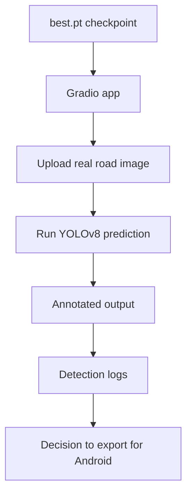
```mermaid
flowchart TD
    A[best.pt checkpoint] --> B[Gradio app]
    B --> C[Upload real road image]
    C --> D[Run YOLOv8 prediction]
    D --> E[Annotated output]
    E --> F[Detection logs]
    F --> G[Decision to export for Android]
```

## Files

- [04_model_deployment_using_Gradio.ipynb](notebooks/04_model_deployment_using_Gradio.ipynb)
- [Gradio test images](reports/gradio_tests/images)
- [Gradio test logs](reports/gradio_tests/logs)

</details>

<details>
<summary><strong>📱 TFLite Export and Android Deployment</strong></summary>

## Export Architecture

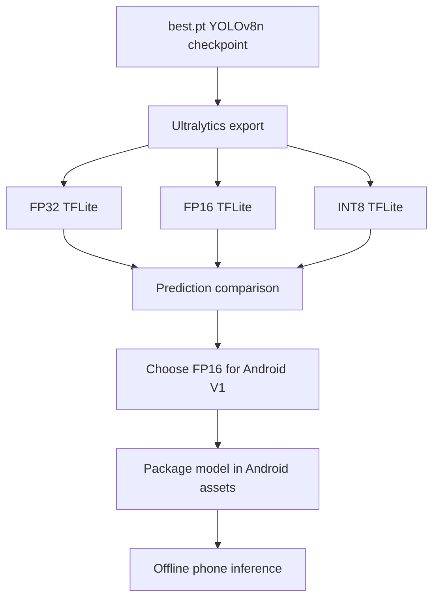
```mermaid
flowchart TD
    A[best.pt YOLOv8n checkpoint] --> B[Ultralytics export]
    B --> C[FP32 TFLite]
    B --> D[FP16 TFLite]
    B --> E[INT8 TFLite]
    C --> F[Prediction comparison]
    D --> F
    E --> F
    F --> G[Choose FP16 for Android V1]
    G --> H[Package model in Android assets]
    H --> I[Offline phone inference]
```

## Export Summary

| Export | Status | Size | NMS | Android decision |
|---|---|---:|---|---|
| FP32 TFLite | Success | 11.78 MB | Yes | Debug/reference |
| FP16 TFLite | Success | 11.79 MB | Yes | Used in Android app |
| INT8 TFLite | Success | 3.18 MB | Yes | Kept for future calibration |

## Android Inference Speed

| Item | Value |
|---|---|
| Runtime model | `dhakaroadnet_yolov8n_fp16.tflite` |
| Input size | 640 x 640 |
| Runtime | TensorFlow Lite on Android |
| Observed speed | Around 500 ms per inference on tested devices |
| Timing note | Real-device timing; speed can vary by phone hardware, CPU load, image complexity, and live camera mode |

The Android app measures inference time in milliseconds and shows it in image detection results and live detection status.

## Android App Architecture

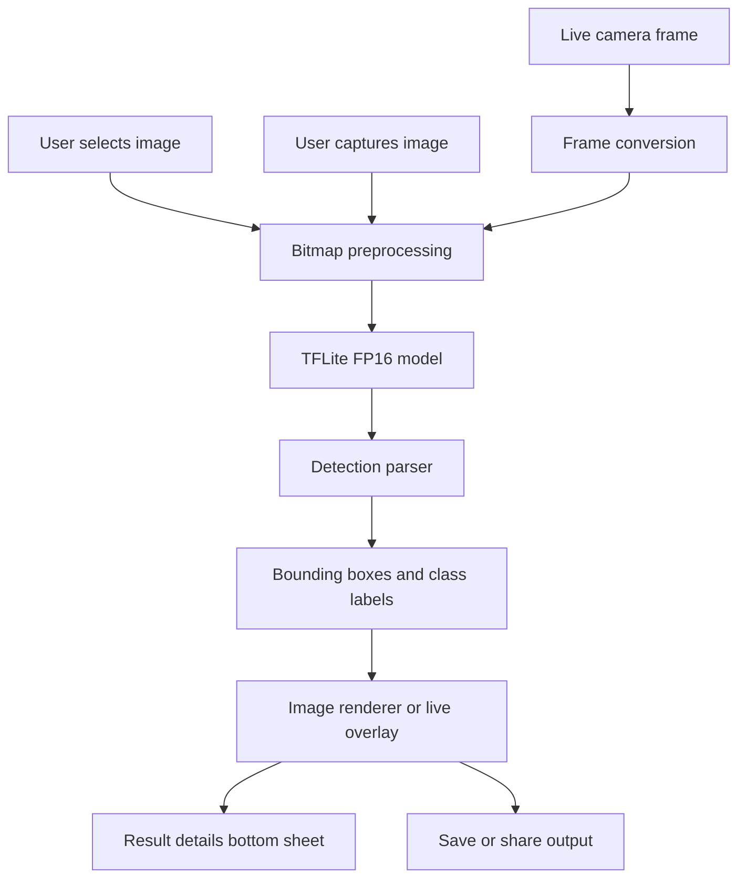
```mermaid
flowchart TD
    A[User selects image] --> D[Bitmap preprocessing]
    B[User captures image] --> D
    C[Live camera frame] --> E[Frame conversion]
    E --> D
    D --> F[TFLite FP16 model]
    F --> G[Detection parser]
    G --> H[Bounding boxes and class labels]
    H --> I[Image renderer or live overlay]
    I --> J[Result details bottom sheet]
    I --> K[Save or share output]
```

## Android Features

- Native Kotlin/XML app.
- TensorFlow Lite FP16 model in app assets.
- Offline inference with no API call.
- Gallery upload and camera capture.
- Live video detection using CameraX.
- Bounding-box overlay and detection details.
- Save/share annotated results.
- Research-style home screen with project summary and report evidence.

## Files

- [05_export_tflite.ipynb](notebooks/05_export_tflite.ipynb)
- [export_summary.md](reports/tflite_export/export_summary.md)
- [dhakaroadnet_yolov8n_fp16.tflite](model/exported/tflite/dhakaroadnet_yolov8n_fp16.tflite)
- [labels.txt](model/exported/tflite/labels.txt)
- [Android app source](android_app)

</details>

<details>
<summary><strong>🏗️ Architecture Diagrams</strong></summary>

## Dataset Creation Architecture

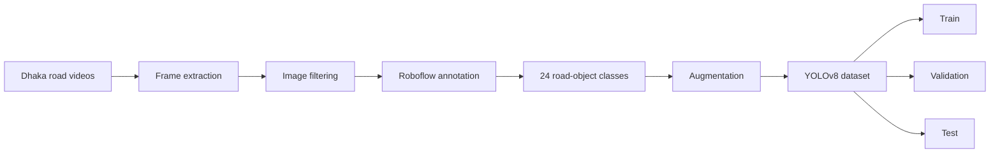
```mermaid
flowchart LR
    A[Dhaka road videos] --> B[Frame extraction]
    B --> C[Image filtering]
    C --> D[Roboflow annotation]
    D --> E[24 road-object classes]
    E --> F[Augmentation]
    F --> G[YOLOv8 dataset]
    G --> H[Train]
    G --> I[Validation]
    G --> J[Test]
```

## Model Creation and Deployment Architecture

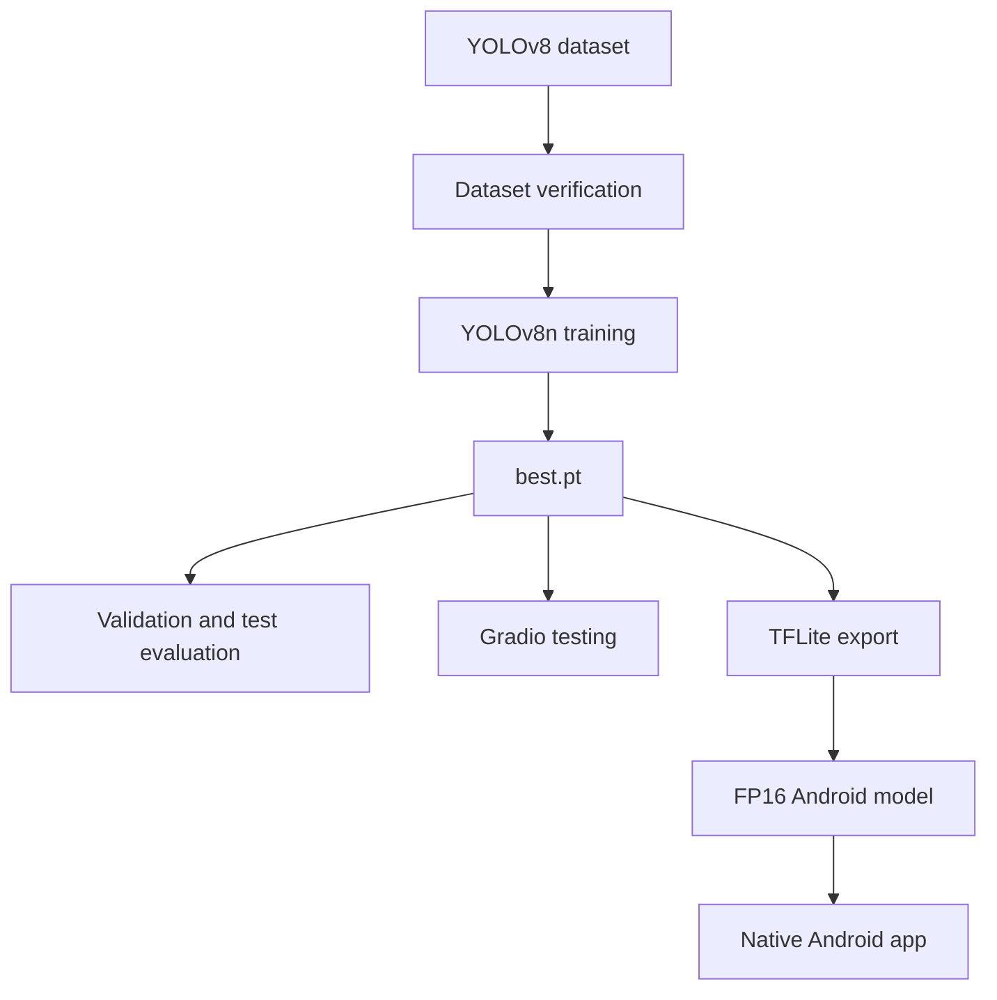
```mermaid
flowchart TD
    A[YOLOv8 dataset] --> B[Dataset verification]
    B --> C[YOLOv8n training]
    C --> D[best.pt]
    D --> E[Validation and test evaluation]
    D --> F[Gradio testing]
    D --> G[TFLite export]
    G --> H[FP16 Android model]
    H --> I[Native Android app]
```

## Android Application Architecture

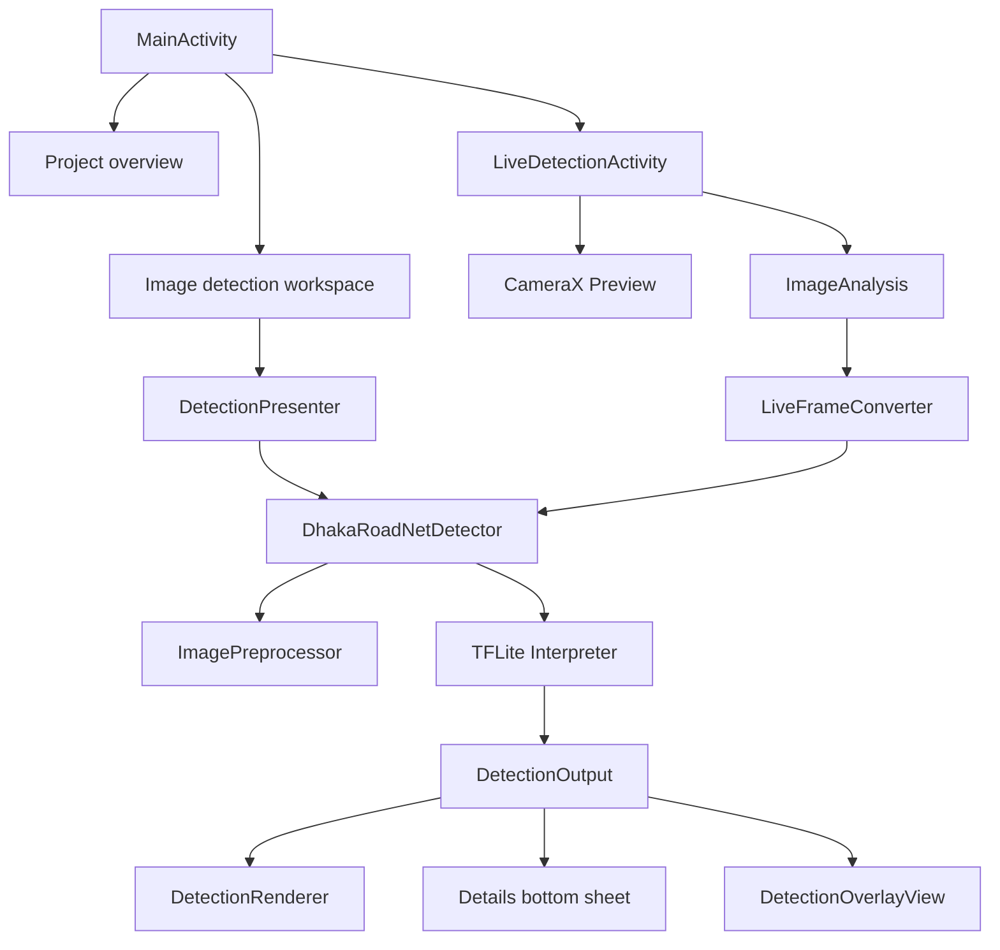
```mermaid
flowchart TD
    A[MainActivity] --> B[Project overview]
    A --> C[Image detection workspace]
    C --> D[DetectionPresenter]
    D --> E[DhakaRoadNetDetector]
    E --> F[ImagePreprocessor]
    E --> G[TFLite Interpreter]
    G --> H[DetectionOutput]
    H --> I[DetectionRenderer]
    H --> J[Details bottom sheet]
    A --> K[LiveDetectionActivity]
    K --> L[CameraX Preview]
    K --> M[ImageAnalysis]
    M --> N[LiveFrameConverter]
    N --> E
    H --> O[DetectionOverlayView]
```

## Full Research-to-App Architecture

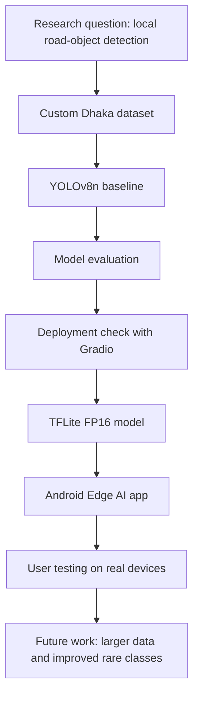
```mermaid
flowchart TD
    A[Research question: local road-object detection] --> B[Custom Dhaka dataset]
    B --> C[YOLOv8n baseline]
    C --> D[Model evaluation]
    D --> E[Deployment check with Gradio]
    E --> F[TFLite FP16 model]
    F --> G[Android Edge AI app]
    G --> H[User testing on real devices]
    H --> I[Future work: larger data and improved rare classes]
```

</details>

<details>
<summary><strong>📁 Folder Structure</strong></summary>

```text
DhakaRoadNet-EdgeAI/
├── android_app/                         # Native Android Kotlin/XML app
│   └── app/src/main/assets/             # TFLite model and labels used by Android
├── model/
│   ├── checkpoints/                     # best.pt, last.pt, exported saved model files
│   ├── exported/tflite/                 # FP32, FP16, INT8 TFLite exports and labels
│   └── runs/                            # YOLO training outputs
├── notebooks/
│   ├── 01_dataset_download_and_verification.ipynb
│   ├── 02_training.ipynb
│   ├── 03_evaluation_and_analysis.ipynb
│   ├── 04_model_deployment_using_Gradio.ipynb
│   └── 05_export_tflite.ipynb
├── reports/
│   ├── figures/                         # Dataset visualization reports
│   ├── training/                        # Training curves and config
│   ├── evaluation/                      # Metrics, plots, weak-class analysis
│   ├── gradio_tests/                    # Gradio test images and logs
│   └── tflite_export/                   # Export summaries and prediction checks
└── README.md
```

</details>

<details>
<summary><strong>⚙️ Environment and Configuration</strong></summary>

## Training Environment

| Item | Value |
|---|---|
| GPU | NVIDIA GeForce RTX 3050 |
| GPU memory | 6143 MiB |
| CUDA stack | CUDA-enabled PyTorch |
| PyTorch | 2.12.0+cu126 |
| Ultralytics | 8.4.x |
| Training Python | 3.14.2 |

## TFLite Export Environment

| Item | Value |
|---|---|
| Python | 3.12.10 |
| TensorFlow | 2.20.0 |
| Export model | YOLOv8n best.pt |
| Android export used | FP16 TFLite |

## Android Environment

| Item | Value |
|---|---|
| Language | Kotlin |
| UI | XML layouts |
| Runtime model | TensorFlow Lite FP16 |
| Live camera | CameraX |
| App mode | Offline inference |

</details>

<details>
<summary><strong>🖼️ Report Gallery</strong></summary>

## Curated Visual Evidence

| Dataset and Training | Evaluation and Deployment |
|---|---|
| 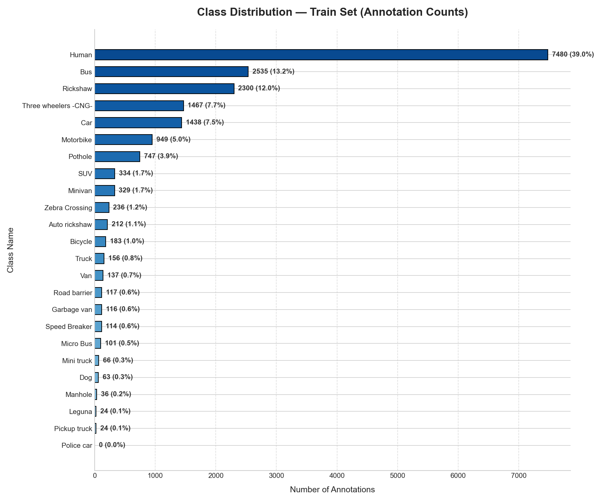 | 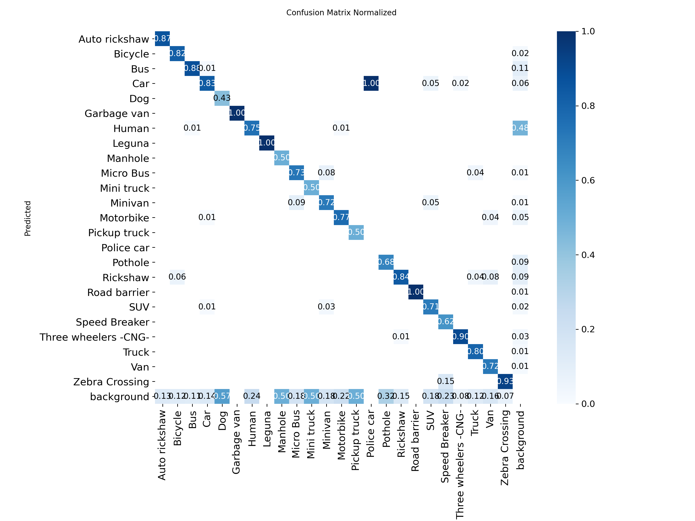 |
| 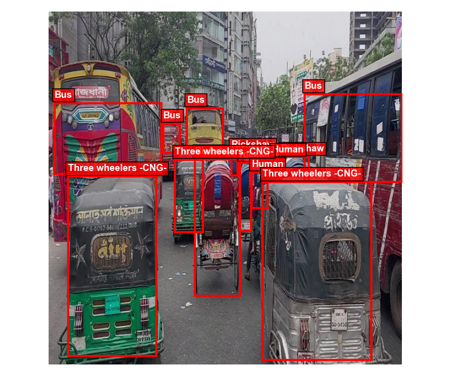 | 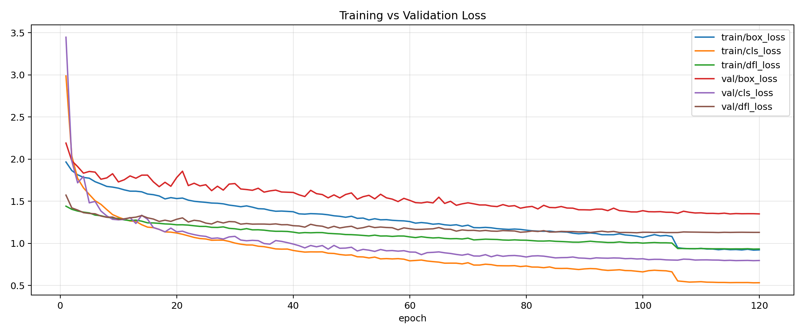 |
| 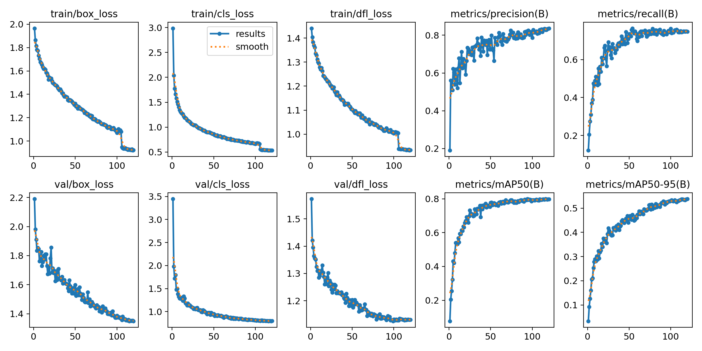 | 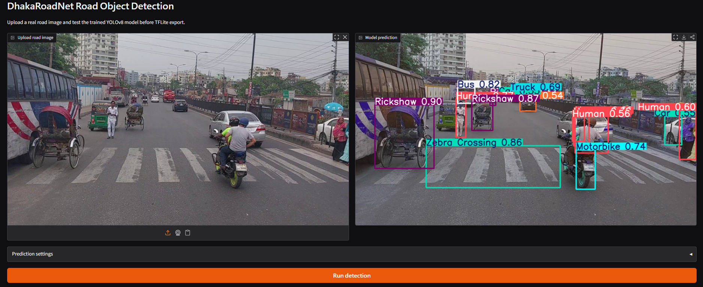 |
| 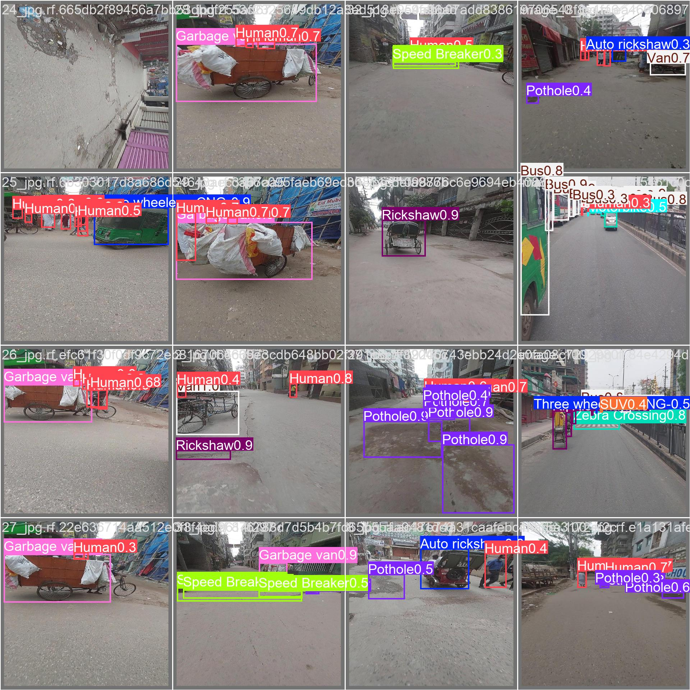 | 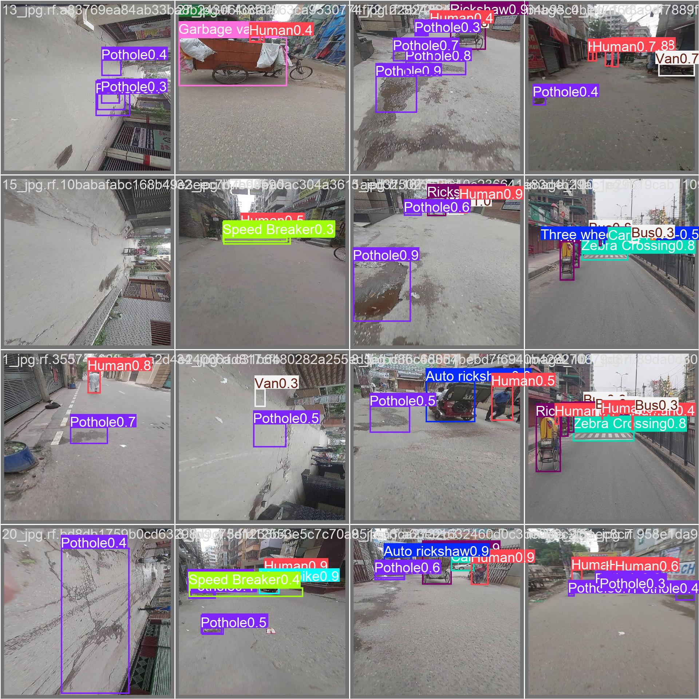 |

## More Report Folders

- [Dataset figures](reports/figures)
- [Training reports](reports/training/yolov8n_dhakaroadnet_baseline)
- [Evaluation plots](reports/evaluation/plots)
- [Evaluation predictions](reports/evaluation/predictions)
- [Gradio tests](reports/gradio_tests)
- [TFLite export reports](reports/tflite_export)
- [Android app report images](android_app/app/src/main/res/drawable-nodpi)

</details>

<details>
<summary><strong>🔮 Future Improvements</strong></summary>

- Collect more samples for rare classes such as Police car, Leguna, Pickup truck, Manhole, and Mini truck.
- Improve road-surface classes such as Pothole, Speed Breaker, Zebra Crossing, and Manhole.
- Add more night, rain, shadow, and low-light road scenes.
- Compare YOLOv8n with YOLOv8s or newer lightweight models.
- Improve INT8 calibration so a smaller Android model can be used safely.
- Add tracking for live video detection.
- Add speed/FPS benchmarking across multiple Android phones.
- Prepare a larger research report or paper-style writeup from the final pipeline.

</details>

## Final Note

DhakaRoadNet is a beginner-friendly but complete Edge AI research prototype. It shows the full path from local road data to a working Android app. The main value of the project is not only the final accuracy, but the complete reproducible pipeline: dataset creation, model training, evaluation, model export, and real-device Android deployment.
